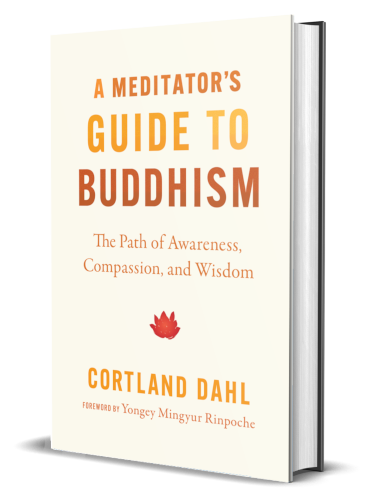

# A Meditator's Guide to Buddhism

By Cortland Dahl

A wonderfully accessible and practical introduction to the concepts and practices of Buddhism for the modern age.

I have read several books on Buddhism. Most are rather esoteric, mystical, and filled with stories that seem more like myth and magic than real useful guidance. Cortland Dahl's book has none of these issues, and reads wonderfully for the skeptical scientific mind of the 2020s.

### Sparks

> Renunciation forms such an important part of Siddhartha's story — he had to turn away from the familiar in order to make space for something new in his life. Indeed, renunciation is as much about turning toward something new as it is an act of letting go.
>
> [14]

 

> We humans are incredibly good at adapting to our current circumstances. When we get something we want or something we dislike comes to an end, it very quickly becomes our new normal. The new situation ceases to be fulfilling, and our minds turn to the next point on the horizon.
>
> [46]

 

> When we get attached, such as while feeling an intense desire, we tend to screen out the negative aspects of whatever it is we desire and overly fixate on its positive qualities. Think of your favorite guilty pleasure. Are there any negative aspects of the experience?
>
> Now, think of a moment when you feel a strong pull toward the object or activity. Do you think about these negative aspects? Probably not.
>
> [48]

...But what if you *did*?

 

> Most of us tend to treat moments of distractions [while meditating] as failure, but noticing a moment of distraction is a big success. These are moments when we shift from living in our thoughts and emotions to enacting present moment awareness.
>
> [54]

 

> Where I work, we even meditate for a minute or two to start meetings. With practice, you can learn to transform everything you do into meditation.
>
> [78]

 

> Suffering thrives in the space between our expectations and reality.
>
> [91]

 

> Nothing exists on its own. We might feel cut off and separate from other people and from the world around us, but in reality, our experience is being shaped in each moment by countless other factors. When we explore this complex web of conditions, we see firsthand that there is no "I" or "me" that is truly separate.
>
> [98]

 

> [When someone else says something angry, negative, or condescending...]
>
> Or maybe you see that they too are suffering. They are caught up in their own reactions and lashing out, and the insight might naturally lead to compassion.
>
> [106]

 

> You might notice that you are more distracted after some activities. I myself find that even having the inspiration to meditate can decrease when I spend too much time on my phone or get caught up in other activities.
>
> [112]

 

> Nirvana is not a place or a new plane of existence. It is a direct experience of the unconditioned nature of reality.
>
> [116]

 

> The most compassionate people I know are also the most joyful and content. Our own happiness and well-being are unexpected by-products of focusing on the welfare of others.
>
> [126]

 

> It's about being deeply sensitive to the ripple effects that our thoughts, words, and actions have on ourselves and others.
>
> [144]

 

> For the first time, I saw that pain and suffering are not the same thing. With that shift, the ongoing experiences of pain and aversion felt small and insignificant, like nothing more than little clouds passing through the vast expanse of the sky.
>
> [155]

 

> We see buddha nature in ourselves and in others, whether or not they see it for themselves. This is the heart of pure perception.
>
> [184]

 

> As great as the highs of the spiritual journey may feel, it is often how we navigate the lows that really matters, and even more so how we handle the countless mundane moments of life that usually go unnoticed.
>
> [189]

 

> The human existence is said to hold the most potential. We have just the right balance of suffering and intelligence that allows us to ask questions.
>
> [194]

 

> Paradoxically, the big challenge in meditation is not always the difficult experiences — it can just as easily be the pleasant ones.
>
> Positive experiences can be intoxicating. [Thus distracting from our state of pure awareness.]
>
> [200]

A relevant phrase I have heard elsewhere: "Tolerate happiness."

 

> You don't have to stop being angry, if that's what you're feeling. The transformative power of the practice is in the act of connecting to awareness. The center of your experience shifts from the experience itself (anger) to awareness, and when you do that, you are free.
>
> [203]

 

> The sky is simply the open space that can accommodate everything. The openness of the sky is so ordinary, and so pervasive, we might miss it, but without that openness, nothing else would be possible. There would be no room for all the colorful weather patterns that come and go.
>
> The same is true for us. We get so caught up in all the weather patterns of life, we completely miss the basic openness of our own being.
>
> [205]

 

---

 

Return to the [Book List](Readme.md#book-list).
