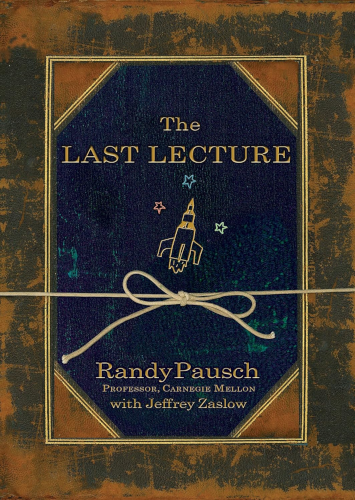

# The Last Lecture

By Randy Pausch

Diagnosed with terminal pancreatic cancer, computer science professor Randy Pausch gives a last lecture — not on computer science, but on pursuing and really achieving one's dreams.

If the words *computer science* make you feel hesitant, worry not: this book is 1% computer science and 99% how to life a great life.

### Sparks

> "What makes me unique?"
>
> That was the question I felt compelled to address.
>
> Cancer doesn't make me unique. More than 37,000 Americans a year are diagnosed with pancreatic cancer alone.
>
> It came to me in a flash. My uniqueness, I realized, came in the specifics of all the dreams — from incredibly meaningful to decidecly quirky — that defined my forty-six years of life.
>
> [9]

 

> "Excuse me, Coach. There are no footballs."
>
> "How many men are on the football field at a time?"
>
> Eleven on a team, we answered. So that makes twenty-two.
>
> "And how many people are touching the football at any given time?"
>
> One of them.
>
> "Right!" he said. "So we're going to work on what those *other* twenty-one guys are doing."
>
> [35]

 

> The brick walls are there for a reason. They're not there to keep us out. The brick walls are there to gives a chance to show how badly we want something.
>
> [51]

 

> No matter how bad things are, you can always make things worse. At the same time, it is often within your power to make them better.
>
> [88]

 

> When you use money to fight poverty, it can be of great value. But too often, you're working at the margins. When you're putting people on the moon, you're inspiring all of us to achieve the maximum of human potential, which is how our greatest problems will eventually be solved.
>
> [132]

 

> Complaining does not work as a strategy. We all have finite time and energy. Any time we spend whining is unlikely to help us achieve our goals. And it won't make us happier.
>
> [139]

 

> When I have to work with other people, I try to imagine us sitting together with a deck of cards. My impulse is always to put all my cards on the table, face up, and to say to the group, "OK, what can we collectively make of this hand?"
>
> [142]

 

---

 

Return to the [Book List](Readme.md).
